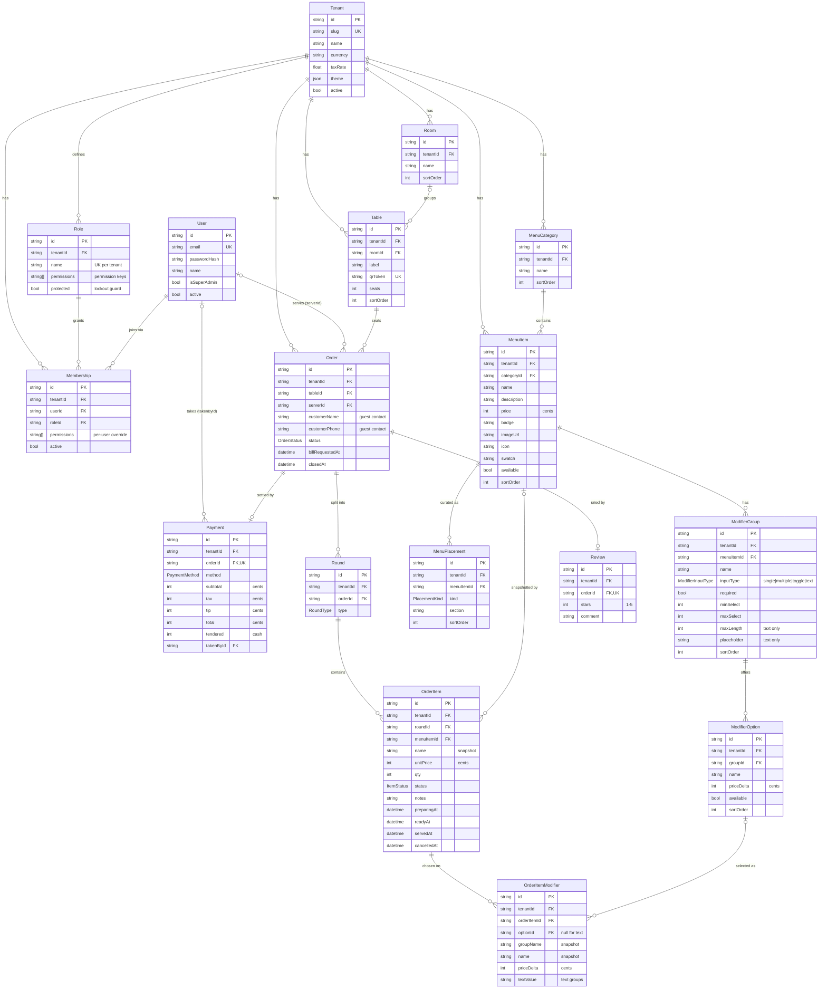

# Amber & Grain — Database ERD

Generated from `prisma/schema.prisma`. Tenant is the root; every operational row
carries `tenantId` for multi-tenant scoping (those tenant edges are omitted below
to keep the diagram readable — assume every entity also points back to `Tenant`).

## RBAC
- **Role** is now a **per-tenant table** (not an enum) — Admins create/rename
  custom roles. `Role.permissions` + the per-user `Membership.permissions`
  override are arrays of **permission keys** (the fixed catalog in `@amber/domain`
  `PERMISSIONS`): `dashboard.view · menu.manage · tables.manage · kds.use ·
  orders.history · analytics.view · settings.manage · team.manage`.
  Effective access = `Membership.permissions` if non-empty, else `Role.permissions`.

## Enums
- **ModifierSelection**: single · multiple
- **PlacementKind**: featured · welcome
- **OrderStatus**: open · billed · paid · closed
- **RoundType**: instant · bundled
- **ItemStatus**: placed · preparing · ready · served · cancelled
- **PaymentMethod**: cash · card

## Cardinality notes
- `|o` / `o{` = optional side (nullable FK): `Order.serverId`, `Table.roomId`,
  `OrderItem.menuItemId`, `OrderItemModifier.optionId`, `Payment.takenById` are all nullable.
- `Order → Payment` and `Order → Review` are **1-to-(0..1)** (`orderId` is `@unique`).
- Snapshot fields (`OrderItem.name/unitPrice`, `OrderItemModifier.name/priceDelta`)
  preserve display when the source menu item/option is later deleted (FK → null).
